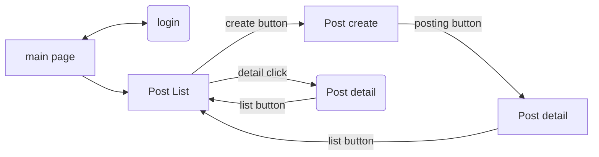

Frontend

> language : Javascript
>
> Framework : vue.js
>
> Theme : Bootstrap - album style

Main page / Post List Page  구현방식

> HTML structure :  Header - Home - Footer
>
> Post Making Method : card.vue 로 componets 화 시킨 후 v-for 문으로 생성
>
> ​ ( changing local port 8080 -> 3000 (because backend local port : 8080) )
>
> HTTP Request method : Axios

상품 상세 페이지 ( Post detail page )

> 모달창 방식 사용 ( Modal )

Login Logout 관리

> 로그인 상태 유지  : Vuex 사용 ( front에서 )
>
> 로그인 상태시 새로고침하면 로그아웃되는 현상 : sessionStorage를 이용
>
>
> 로그인 인증 정보 검증 방식 : JsonWebToken ( JWT )

