## 🚀 실제 CI/CD 파이프라인 흐름

최근 DevOps 분야에서 CI/CD는 필수적인 개발 프로세스가 되었습니다. 이번 글에서는 실제로 구현한 CI/CD 파이프라인의 전체 흐름을 단계별로 살펴보겠습니다.

## 📋 CI/CD 파이프라인 전체 흐름

```mermaid
graph LR
    A[코드 변경] --> B[GitHub Push]
    B --> C[GitHub Actions 트리거]
    C --> D[빌드 & 테스트]
    D --> E[Docker 이미지 생성]
    E --> F[이미지 푸시]
    F --> G[AWS EC2 배포]
```



### 1️⃣ 코드 변경 → GitHub에 Push

개발자가 로컬에서 코드를 수정하고 커밋한 후 GitHub 원격 저장소에 푸시하는 단계입니다.

```bash
git add .
git commit -m "feature: 새로운 기능 추가"
git push origin main
```

이 단계에서 중요한 점:
- **브랜치 전략**: main, develop, feature 브랜치를 활용한 체계적인 관리
- **커밋 메시지**: 일관된 형식으로 변경사항을 명확히 기록
- **코드 리뷰**: PR(Pull Request)을 통한 코드 품질 검증

### 2️⃣ GitHub Actions → 자동 트리거

GitHub에 코드가 푸시되면 GitHub Actions 워크플로우가 자동으로 실행됩니다.

```yaml
name: CI/CD Pipeline
on:
  push:
    branches: [ main ]
  pull_request:
    branches: [ main ]

jobs:
  build-and-deploy:
    runs-on: ubuntu-latest
```

**트리거 조건**:
- `push`: main 브랜치에 코드가 푸시될 때
- `pull_request`: PR이 생성되거나 업데이트될 때
- `schedule`: 정해진 시간에 주기적으로 실행

### 3️⃣ 빌드 & 테스트 → 코드 컴파일, 테스트 실행

소스 코드를 컴파일하고 각종 테스트를 실행하여 코드 품질을 검증합니다.

```yaml
- name: Setup Node.js
  uses: actions/setup-node@v3
  with:
    node-version: '18'

- name: Install dependencies
  run: npm install

- name: Run tests
  run: npm test

- name: Build application
  run: npm run build
```

**테스트 종류**:
- **단위 테스트(Unit Test)**: 개별 함수/메소드 검증
- **통합 테스트(Integration Test)**: 모듈 간 상호작용 검증
- **E2E 테스트**: 전체 애플리케이션 플로우 검증

### 4️⃣ Docker 이미지 생성 → 애플리케이션 컨테이너화

빌드된 애플리케이션을 Docker 이미지로 패키징합니다.

```dockerfile
FROM node:18-alpine
WORKDIR /app
COPY package*.json ./
RUN npm install --production
COPY . .
EXPOSE 3000
CMD ["npm", "start"]
```

```yaml
- name: Build Docker image
  run: docker build -t myapp:${{ github.sha }} .

- name: Tag Docker image
  run: docker tag myapp:${{ github.sha }} myapp:latest
```

**Docker 이미지의 장점**:
- **환경 일관성**: 개발, 테스트, 운영 환경에서 동일한 실행 환경
- **배포 간소화**: 이미지 하나로 어디서든 실행 가능
- **롤백 용이성**: 이전 버전 이미지로 빠른 롤백 가능

### 5️⃣ 이미지 푸시 → Docker Hub 또는 AWS ECR에 저장

생성된 Docker 이미지를 컨테이너 레지스트리에 저장합니다.

```yaml
- name: Login to Docker Hub
  uses: docker/login-action@v2
  with:
    username: ${{ secrets.DOCKER_USERNAME }}
    password: ${{ secrets.DOCKER_PASSWORD }}

- name: Push to Docker Hub
  run: |
    docker push myapp:${{ github.sha }}
    docker push myapp:latest
```

**레지스트리 선택 기준**:
- **Docker Hub**: 공개 프로젝트, 무료 사용
- **AWS ECR**: AWS 생태계, 보안 강화
- **GitHub Container Registry**: GitHub와 통합, 프라이빗 무료

### 6️⃣ AWS EC2 배포 → 새로운 이미지로 자동 배포 및 실행

마지막으로 AWS EC2 인스턴스에 새로운 이미지를 배포하고 실행합니다.

```yaml
- name: Deploy to EC2
  uses: appleboy/ssh-action@v0.1.5
  with:
    host: ${{ secrets.EC2_HOST }}
    username: ubuntu
    key: ${{ secrets.EC2_PRIVATE_KEY }}
    script: |
      docker pull myapp:latest
      docker stop myapp-container || true
      docker rm myapp-container || true
      docker run -d --name myapp-container -p 80:3000 myapp:latest
```

**배포 전략**:
- **Blue-Green 배포**: 무중단 배포를 위한 두 환경 교체
- **Rolling 배포**: 점진적으로 인스턴스 교체
- **Canary 배포**: 일부 트래픽만 새 버전으로 라우팅

## 🔧 파이프라인 최적화 포인트

### 1. 캐싱 활용
```yaml
- name: Cache node modules
  uses: actions/cache@v3
  with:
    path: ~/.npm
    key: ${{ runner.os }}-node-${{ hashFiles('**/package-lock.json') }}
```

### 2. 병렬 처리
```yaml
jobs:
  test:
    runs-on: ubuntu-latest
  build:
    runs-on: ubuntu-latest
  deploy:
    needs: [test, build]
    runs-on: ubuntu-latest
```

### 3. 조건부 실행
```yaml
- name: Deploy to production
  if: github.ref == 'refs/heads/main'
  run: echo "Deploying to production"
```

## 🚨 주의사항 및 모범 사례

### 보안
- **Secrets 관리**: GitHub Secrets를 활용한 민감정보 보호
- **최소 권한 원칙**: 필요한 최소한의 권한만 부여
- **이미지 스캔**: Docker 이미지 보안 취약점 검사

### 모니터링
- **로그 수집**: 애플리케이션 및 인프라 로그 중앙화
- **메트릭 수집**: 성능 지표 모니터링
- **알림 설정**: 장애 발생 시 즉시 알림

### 백업 및 복구
- **데이터베이스 백업**: 정기적인 자동 백업
- **롤백 계획**: 빠른 이전 버전 복구 방안
- **재해 복구**: 인프라 장애 대응 계획

## 💡 마무리

CI/CD 파이프라인은 단순히 자동화를 위한 도구가 아닙니다. 개발팀의 생산성을 높이고, 배포 리스크를 줄이며, 더 안정적인 서비스를 제공하기 위한 핵심 인프라입니다.

처음에는 복잡해 보일 수 있지만, 단계별로 구축하다 보면 개발 프로세스가 얼마나 효율적으로 개선되는지 체감할 수 있을 것입니다.

다음 글에서는 실제 GitHub Actions 워크플로우 파일 작성법과 AWS 배포 설정에 대해 더 자세히 다뤄보겠습니다.

---

**참고 자료**
- [GitHub Actions Documentation](https://docs.github.com/en/actions)
- [Docker Best Practices](https://docs.docker.com/develop/dev-best-practices/)
- [AWS EC2 User Guide](https://docs.aws.amazon.com/ec2/)