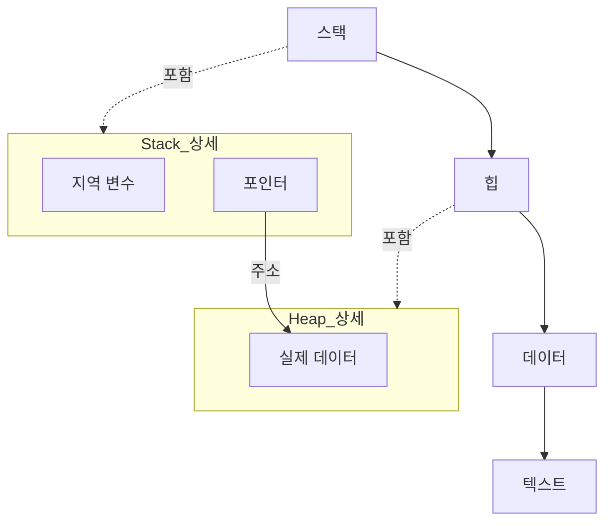

스택은 자동 메모리, 힙은 자유 저장소. 스택에는 힙 데이터의 "주소(포인터)"만 저장된다. 메모리 누수를 막으려면 힙 데이터는 사용 종료 시 `free()`로 해제한다.

핵심만 기억하기
- 스택엔 주소(포인터) 저장, 힙엔 실제 데이터 생성.
- 쓰임이 끝난 힙 데이터는 `free()`로 해제해 누수를 방지.

스택
- 함수 호출마다 생기는 "자동 메모리" 영역 (LIFO).
- 지역 변수, 리턴 주소 등이 저장되고, 함수가 끝나면 자동으로 정리됨.
- 매우 빠르지만 크기가 제한적이고, 길게 유지되는 데이터에는 부적합.

힙
- 개발자가 요청해 할당하는 "자유 저장소"(동적 메모리).
- 실제 데이터(객체, 버퍼)가 생성되며, 포인터로 접근함.
- 자동으로 사라지지 않아서, 사용이 끝나면 반드시 `free()`/`delete`로 해제해야 함.

함수 호출과 실행/종료 순서
- 함수 호출은 스택 자료구조처럼 동작: 마지막에 호출된 함수가 가장 먼저 종료(LIFO).
- 함수 내부에서 변수는 코드가 "순차적으로" 실행되며 생성/사용되고,
- 함수가 종료되면 스택 프레임이 "역순"으로 정리되어 지역 변수들이 함께 사라짐.

주의: 힙 이름 혼동 금지
- 메모리의 "힙 영역"은 동적 메모리 공간을 의미하며,
- 자료구조의 "힙(Heap)"과는 이름만 같고 동작/의미가 전혀 다름.
