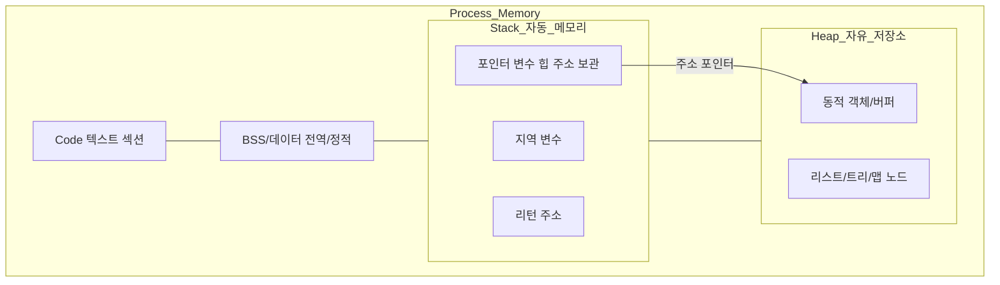
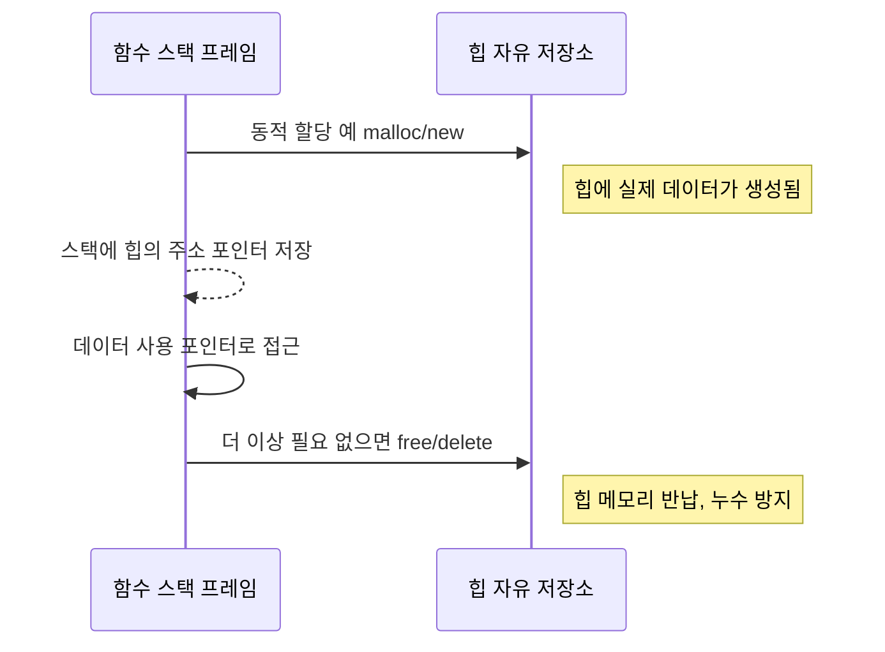
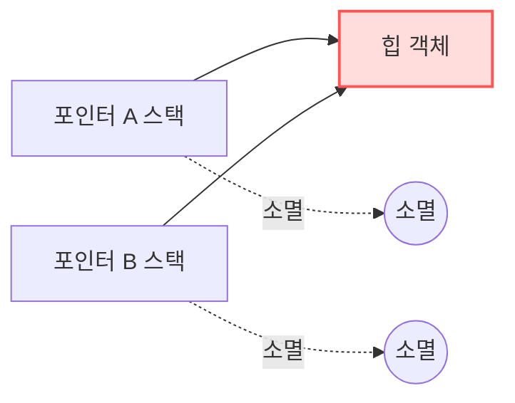

> 스택은 자동 메모리, 힙은 자유 저장소. 스택에는 힙 데이터의 "주소(포인터)"만 저장된다. 따라서 메모리 누수를 막으려면, 힙에 올린 데이터는 더 이상 쓸 일이 없을 때 `free()`로 해제해야 한다.

## 전체 그림으로 이해하는 메모리 구조

아래 그림처럼 프로세스 메모리는 크게 코드/데이터/스택/힙 영역으로 나뉜다. 스택은 위에서 아래로 자동으로 쌓이고 함수가 끝나면 자동으로 정리된다. 힙은 아래에서 위로 필요할 때 동적 할당되며, 개발자가 직접 관리해야 한다.

핵심 포인트
- 스택: 함수 호출 시 자동으로 프레임이 생기고 끝나면 자동 제거. 지역 변수의 실제 데이터가 스택에 놓인다.
- 힙: `malloc/new`로 동적 생성. 언제 사라질지 알 수 없기에 `free/delete`로 수명 관리가 필요.
- 포인터: 스택에는 "힙 객체의 주소"만 저장해서 힙에 있는 실제 데이터를 가리킨다.

## 스택과 힙의 상호작용

스택 변수 포인터가 힙 객체를 가리키는 전형적인 구조:

- 함수 내부에서 포인터 스택는 사라질 수 있지만, 힙 객체는 남아 있을 수 있다. 포인터가 사라지기 전에 반드시 힙 객체를 해제해야 누수가 없다.
- 포인터 복사본이 여럿이라면, 마지막 참조가 끝나는 시점에 정확히 한 번 해제해야 한다(이중 해제 방지).

## 메모리 누수, 왜 생길까?

메모리 누수는 "힙에 있는 객체에 대한 모든 경로 포인터가 사라졌는데, 힙 객체가 해제되지 않은 상태"를 말한다.

- 모든 포인터가 사라지면, 더 이상 접근할 방법이 없어져 영구히 남아버린다.
- 해결: 수명 주도 관리. "누가 생성했고, 언제 해제할지"를 명확히. 한 번만 해제.

## 안전한 패턴과 체크리스트

- 생성과 해제의 짝을 맞추기: "할당한 곳" 또는 "소유자"가 책임지고 `free()`/`delete` 실행.
- 소유권을 명확히: 한 객체만 해제 책임을 갖도록 설계(참조 카운팅, 스마트 포인터, RAII 등 언어별 도구 활용).
- 조기 반환/예외에도 누수 없게: 해제 경로를 공통화하거나, 스코프 기반 관리 도입.
- 중복 해제 금지: 해제 후 포인터를 `null`로 설정하거나, 소유권 모델로 예방.
- 장수 객체/캐시: 주기적 정리 정책과 종료 훅에서 해제.

## 스택 vs 힙, 한눈 비교

- 스택: 자동, LIFO, 함수 종료 시 정리, 빠름, 크기 제한 존재.
- 힙: 수동(또는 런타임 관리), 임의 수명, 상대적으로 느림, 파편화 가능.
- 스택에는 주소 포인터만, 힙에는 실제 데이터.

## 마무리 요약

- "스택은 자동 메모리, 힙은 자유 저장소"라는 관점을 기억하자.
- 스택 포인터는 힙 객체의 위치만 들고 있다.
- 메모리 누수를 막으려면 힙 객체는 반드시 사용 종료 시 `free()`/`delete`로 해제.

> 추가로 원하는 예시(언어별 코드, 더 복잡한 구조 그림 등)가 있으면 알려주면 해당 형태로 확장해드릴게요.
